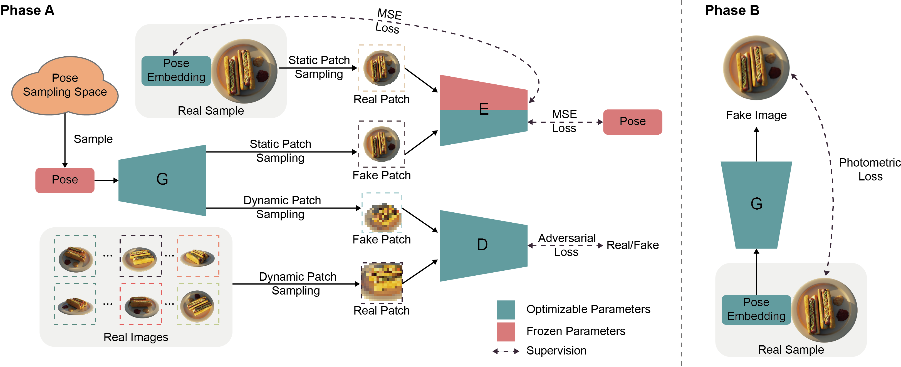

# GNeRF

This repository contains official code for the ICCV 2021 paper:
[GNeRF: GAN-based Neural Radiance Field without Posed Camera](https://arxiv.org/abs/2103.15606). This implementation is
written in [Pytorch](https://pytorch.org/).




## Installation

We recommand using [Anaconda](https://www.anaconda.com/) to setup the environment. Run the following commands:

```
# Create a conda environment named 'gnerf'
conda create --name gnerf python=3.7
# Activate the environment
conda activate gnerf
# Install requirements
pip install -r requirements.txt
```

## Data

### Blender

Download from the [NeRF official Google Drive](https://drive.google.com/drive/folders/128yBriW1IG_3NJ5Rp7APSTZsJqdJdfc1)
. Please download and unzip `nerf_synthetic.zip`.

### DTU

Download the preprocessed [DTU training data](https://drive.google.com/file/d/1eDjh-_bxKKnEuz5h-HXS7EDJn59clx6V/view)
from original [MVSNet repo](https://github.com/YoYo000/MVSNet) and unzip. We also provide a few
[DTU examples](https://drive.google.com/file/d/1vh80KO-EvrUrXuBxzgKJf5Z5hPfPl4Bl/view?usp=sharing) for fast testing.

### Your own data

We share some advices on preparing your own dataset and setting related parameters:

- Pose sampling space should be close to the data: Our method requires a reasonable prior pose distribution.
- The training may fail to converge on symmetrical scenes: The inversion network can not map an image to different poses.

## Running

```
python train.py ./config/CONFIG.yaml --data_dir PATH/TO/DATASET
```

where you replace CONFIG.yaml with your config file (blender.yaml for blender dataset and dtu.yaml for DTU dataset). You
can optionally monitor on the training process using tensorboard by adding `--open_tensorboard` argument. The default
setting takes around 13GB GPU memory. After 40k iterations, you should get a video like these:


## Evaluation

```
python eval.py --ckpt PATH/TO/CKPT.pt --gt PATH/TO/GT.json 
```

where you replace PATH/TO/CKPT.pt with your trained model checkpoint, and PATH/TO/GT.json with the json file in NeRF-Synthetic
dataset. Then, just run the  [ATE toolbox](https://github.com/uzh-rpg/rpg_trajectory_evaluation) on the `evaluation` directory.

